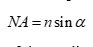

<b>1. Introduction:</b> 
Microscopes are important tools for studying objects too small to be observed by the naked eye. The resolving power of human eye is in the range 0.12-0.2 mm. Microscopes can show us images revealing details finer than 0.1 mm.  They are widely used in a variety of applications. In materials science, they are employed to examine materials at the nano to micron scales. Understanding the features at such scales allows for designing novel materials with tailored properties. Besides, they are also used for process control, including the examination of defects that appear in finished or partly finished products, as well as the studies of parts that have failed during service. Depending on their working principles, microscopes can be of various types, such as optical microscopes, scanning electron microscopes, transmission electron microscopes, etc. Each one of them has its unique benefits and limitations. In the present experiment, we will look into the construction of an optical microscope and its main component  
<b>2. Optical Microscope:</b> 
Optical microscopes use visible light and a lens system to form a magnified image of a specimen. They are the oldest design of microscopes and were invented by Zacharias Janssen in 1590. As they use visible light (λ = 400-700 nm), the maximum theoretical resolution that can be obtained is 0.2 μm.  They are also called compound microscope as they use multiple lens to form an image. The optical microscope can be classified based on the mode of illumination.  If the illumination is via the transmission of light rays through transparent or semi-transparent samples, then the microscope is in the transmission mode, which is normally used while analysing biological samples. On the other hand, reflected illumination is often employed in metallography where materials are typically opaque.  The rays coming from the illumination source, after passing through the condenser and objective lens, are reflected back from the specimen which are then gathered by the objective lens and used to generate a magnified image (see Figure 1). These types of reflection-mode optical microscopes are also known as metallurgical microscopes.  
  
<b>3. Components:</b> 
Mechanical and optical systems are two essential parts of any microscope. The mechanical system typically includes the base, stage, and focusing mechanism. It not only provides a stable platform to the sample but also allow for a precise movement and positioning of specimen in all three orthogonal directions. In addition, the mechanical system assists in focusing the sample by controlling the distance between the objective lens and the sample.  The optical system of the microscope includes the objective lens, eyepiece lens, illuminator, and sometimes additional lenses or mirrors which are used to enhance the quality and orientation of the magnified image. Both mechanical and optical systems are required to work together to generate a high-quality magnified image that can be observed and analysed. It is worth noting that the magnification is denoted by symbol “x” next to a numerical value.  
Figure 2 shows an optical microscope with all the important parts that form the mechanical and optical systems. The description and role of each part is given below.  
	<b>3.1 Eyepiece or ocular lens:</b> This is the lens through which a user looks through to view the specimen. This is present at the upper portion of the microscope. The eyepiece often contains rubber eyecups in which the eyes can be positioned such that no light from outside obstruct the view.  The magnification power of eyepiece lens is typically in the range of 10x to 15x and is lower than that of objective lens. The primary role of this lens is to magnify the image produced by the objective lens and project onto a sensor which can be the human eye or light sensitive camera depending on the microscope setup. In addition, this lens is designed to be adjustable for individual user and thus providing a comfortable viewing experience.   
  
	<b>3.2 Diopter adjustment ring</b>: The diopter adjustment ring is present in one or both eyepieces, and it allows for adjusting the focus of the eyepiece independently to match the observer’s eyesight.  This is useful, especially when there exist differences in vision between both the eyes of the observer. The position of the eyepiece (and magnifying power) can be changed by rotating the diopter adjustment ring present on the eyepiece.  
<b>3.3 Objective lens</b>: This is a primary lens of the optical microscope and is present near to the specimen. Optical microscopes are often equipped with different objective lens of varying magnifying power. The objective lenses are mounted on a rotating nosepiece or turret for an easy selection. The magnification power of the objective lens can vary from 5x to 100x. The total magnification obtained from the microscope is dependent on the combination of eyepiece lens and objective lens. It can be calculated by multiplying the magnification power of the eyepiece, or ocular lens, by the magnification power of the objective lens.  For example, any microscope with an objective lens having a magnifying power of 10x when combined with an eyepiece lens of magnification power 4x, will project an image of the specimen of 400x. Besides magnification, the resolution power of the light microscope is also dependent on the objective lens. The resolution of an optical microscope is defined as a minimum distance between two points that can be resolved as separate entities.  A typical resolution of an optical microscope lies in the range of 200 nm to 500 nm. The lateral resolution (d) can be calculated using the Abbe’s diffraction formula.  
   (1)   
where λ is a wavelength of light used for illumination and NA is the numerical aperture of the objective lens.  It is noteworthy that the light from the specimen enters the objective lens as an inverted cone.  The numerical aperture of the lens is an ability of lens to capture image-forming light emanating from the focussed specimen. The magnitude of NA is an important parameter when trying to distinguish details in the specimen. The objective lens with high NA value shows better details of the generated image. The numerical aperture can be expressed using the following formula.   
   (2)   
where n is the refractive index of the medium present between the cover glass and the front lens of the objective lens while α is half of the angle subtended by the light coming from the specimen to the objective lens. It can be seen from Figure 3 that α is inversely proportional to the focal length of the objective lens.  Thus, the objective lens with higher focal length possesses lower magnitude of NA and thus show lower resolving power.  The NA magnitude can be improved further by immersing the objective lens in oil or water instead of air. These liquids possess higher n value than air, therefore, they tend to refract or bend the light rays that come from the object beneath them. As a result, the angle α increases which raises the NA value.    
<b>3.4	Nosepiece or turret</b>: The nosepiece holds various objective lenses of different magnifying power. By revolving mechanism, it allows the observer to switch from one objective lens to another without having to change the objective lenses manually each time.  
<b>3.5 Eyepiece tube</b>: The eyepiece tube has an eyepiece lens on one end and is attached to the main body (head) of the microscope on the other. It is present just above the objective lens.  The length of the eyepiece tube is adjustable to achieve a clear final image.  It is essential that the intermediate image generated by objective lens is formed at the focal point of the eyepiece. Thus, the length of the eyepiece or the distance between the objective lens and eyepiece is changed such that a sharp and clear magnified image is produced.  
<b>3.6	 Illuminator</b>: It contains a source of light present at the focal point of the condenser lens. Most optical microscopes either operate on halogen bulbs or LED to illuminate the specimen. A condenser lens is also an important part of illuminator which gather the light rays coming from the source and forms a parallel beam of rays. It is present together with a diaphragm which regulates the amount and intensity of light that reaches the specimen. The diaphragm is a circular disc with an adjustable opening located just above the condenser. When too much light passes through a diaphragm, the image becomes overly bright, obscuring all details. On the other hand, allowing too little light to pass will result in a dark image which will be difficult to observe. Thus, the illumination system controls the clarity and contrast of the formed image.  
<b>3.7Half-silvered mirror plate</b>: The half-silvered mirror is kept at an angle of 45o of the vertical axis and is used to divert the parallel light rays coming from the condenser lens towards the objective lens present on top of the sample. In some of the microscopes, prism reflector is used instead of half-silvered mirror.  The beam after reflection from the specimen travel through the objective lens and the transparent portion of the half-silvered mirror plate.  
<b>3.8	Stage</b>: The mechanical stage provides a stable platform to the specimen to be observed.  It is present just below the objective lens. It consists of stage clips to hold the specimen in place during observation. In few cases, stage also contains some scales to help the observer measure the dimensions of the specimen and perform several image analyses. The stage is designed such that the positioning of the specimen can be controlled manually using the mechanical knobs. This allows the observer to examine different areas of the specimen and also focus the specimen to attain bright and clear image.  
<b>3.9 The Adjustment knobs</b>: The adjustment knobs allow the observer to bring the specimen to focus. They are located at the side of the microscope and are used to move either the objective lens or stage to bring the specimen into focus. They are of two types, i.e., fine and coarse focus knobs.  The fine focus knob is used when a slight adjustment is needed to focus the specimen. On the other hand, when large adjustments are required, the coarse focus knob is used. Both these adjustment knobs are coaxial knobs.  
<b>3.10	Base</b>: The base of the microscope contains the stage holding the specimen.  
<b>3.11 Arm</b>: It is a structural component of the microscope connecting the head and base of the microscope.
